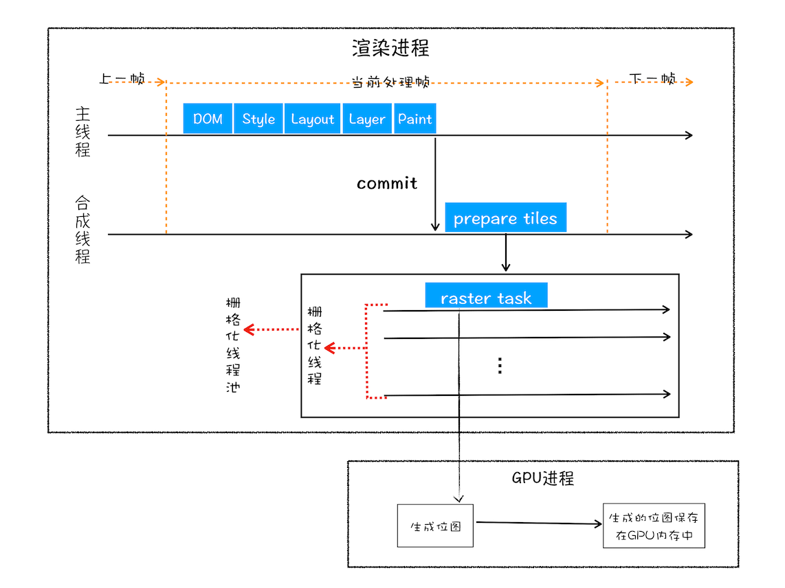

# 渲染流程

## 构建 DOM 树

因为浏览器无法直接理解和使用 HTML，所以需要将 HTML 转化为浏览器能够理解的结构— **DOM 树**。

可以在控制台输入 document 查看

## 样式计算（Recalculate Style）

**CSS 样式来源**：
1. 通过 link 引用外部的 CSS
2. <style> 标签内的 CSS
3. 元素 style 属性内联样式

当渲染引擎接收到 CSS 文本时，会执行一个转换工作，将 CSS 转换为浏览器可以理解的结构— **stylesheets**。

可以在控制台输入 document.stylesheets 查看

### 转换样式表中的属性值，使其标准化

比如 `2em、blue、bold` 等值，渲染引擎为了容易理解，会转换成 2em -> 32px、blue -> rgb(0, 0, 255)、bold -> 700。

### 计算出 DOM 树中每个节点具体样式

计算 DOM 树中每个节点，需要遵守 CSS **继承属性**和**层叠属性**两个规则，并被保存在 ComputedStyle 的结构内。

## 布局阶段

现在，我们有 DOM 树和 DOM 树中元素的样式，但这还不足以显示页面，因为我们还不知道 DOM 元素的几何位置信息。那么接下来就需要计算出 DOM 树中可见元素的几何位置，我们把这个计算过程叫做布局。

### 创建布局树

- 遍历 DOM 树中的所有可见节点，并把这些节点加到布局中；
- DOM 树种有些标签是不可见的，比如 head 标签，还有 display：none 属性的元素，以这个元素也没有被包进布局树；

### 分层

#### 图层树

比如 3D 变动、页面滚动、使用 z-index，为了更方便实现这些效果，渲染引擎需要为特定的节点生成专用的图层，并生成一颗对应的图层树（Layer Tree）。

浏览器的页面实际上被分成很多图层，这些图层叠加后合成最终的页面。

通常情况下，并不是所有的布局树的每个节点都有图层，如果一个节点没有对应图层，则从属于父节点的图层。

**单独图层满足条件**：
1. 拥有层叠上下文属性的元素会被提升为单独一层
2. 需要裁剪地方也会被创建为图层

#### 图层绘制

在完成图层树的构建之后，渲染引擎会对图层树中的每个图层进行绘制。渲染引擎会把每一个图层的绘制分成很多小的**绘制指令**，比如 drawRect、drawPath、restore 等，然后按照顺序依次组成一个待**绘制列表**。绘制列表中的指令其实非常简单，就是让其执行一个简单的绘制操作，比如绘制粉色矩形或者黑色的线等。

## 栅格化操作（raster）

当图层的绘制列表准备好之后，主线程会把该绘制列表提交给**合成线程**。

在有些情况下，有的图层可以很大，比如有的页面你使用滚动条要滚动好久才能滚动到底部，但是通过视口，用户只能看到页面的很小一部分，所以在这种情况下，要绘制出所有图层内容的话，就会产生太大的开销，而且也没有必要。

合成线程会将每个图层划分为多个**图块（tile）**，这些图块的大小通常是 256x256 或者 512x512

合成线程会按照视口附近的图块来优先生成**位图**，实际生成位图的操作是由**栅格化**来执行的。**所谓栅格化，是指将图块转换为位图的过程**。

而图块是栅格化执行的最小单位。渲染进程维护了一个**栅格化线程池（raster）**，所有的图块栅格化都是在线程池内执行的。

通常，栅格化过程都会使用 GPU 来加速生成，使用 GPU 生成位图的过程叫快速栅格化，或者 **GPU 栅格化**，生成的位图被保存在 GPU 内存中。

## 合成和显示

一旦所有的图块都被删格化后，合成线程会生成一个绘制图块的命令——’DrawQuad‘，然后把该命令提交给浏览器，根据 DrawQuad 命令，将其页面内容绘制到内存中，最后会再将内存显示在屏幕上。

# 总结

1. 渲染进程会将 HTML 转换为浏览器理解的 DOM 树
2. 渲染引擎将 CSS 样式转化为浏览器能理解的 styleSheets，计算出 DOM 各个元素的样式
3. DOM 树中有些标签是不需要显示的，所以会过滤掉后生成布局树，计算元素的布局信息
4. 对布局树进行分层，形成多个图层
5. 对每个图层分成很小的绘制指令，依次组成生成绘制列表，并将其提交给合成线程
6. 合成线程将每个图层分成许多图块，并在栅格化线程池中将图块转化为位图
7. 合成线程完成后，发送绘制图块命令 DrawQuad 给浏览器进程
8. 浏览器进程根据 DrawQuad 指令生成页面，并显示在显示器上

